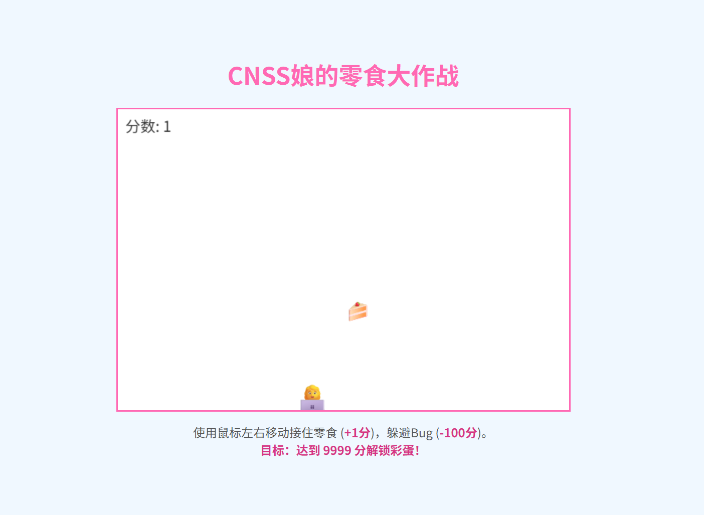
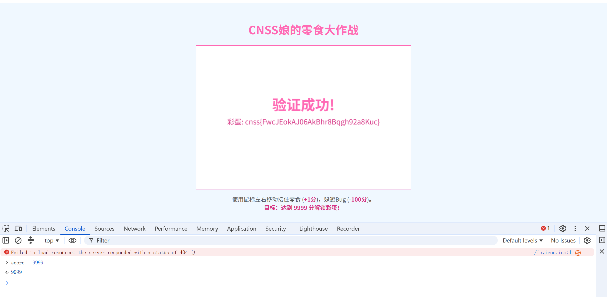

这题打开靶机是一个小游戏

如果你嫌时间长，玩到9999 flag也能出来，但是这道题有个更快的方法。我们直接f12查看源代码
```html
<!DOCTYPE html>
<html lang="zh-CN">
<head>
    <meta charset="UTF-8">
    <title>CNSS娘的零食大作战</title>
    <style>
        body { display: flex; flex-direction: column; justify-content: center; align-items: center; height: 100vh; margin: 0; background-color: #f0f8ff; font-family: sans-serif; }
        h1 { color: #ff69b4; }
        #game-board { border: 2px solid #ff69b4; background-color: #fff; cursor: pointer; }
        #instructions { margin-top: 15px; color: #555; max-width: 600px; text-align: center; }
        #instructions strong { color: #d63384; }
    </style>
</head>
<body>
    <h1>CNSS娘的零食大作战</h1>
    <canvas id="game-board" width="600" height="400"></canvas>
    <div id="instructions">
        使用鼠标左右移动接住零食 (<strong>+1分</strong>)，躲避Bug (<strong>-100分</strong>)。<br>
        <strong>目标：达到 9999 分解锁彩蛋！</strong>
    </div>

    <script>
        const canvas = document.getElementById('game-board');
        const ctx = canvas.getContext('2d');

        let score = 0;
        let gameActive = true;
        const WINNING_SCORE = 9999;
        let scoreSubmitted = false; 


        const player = { x: canvas.width/2-25, y: canvas.height-50, width: 50, height: 50, emoji: '👩‍💻' };
        let items = [];
        canvas.addEventListener('mousemove', e => {
            let rect = canvas.getBoundingClientRect();
            player.x = e.clientX - rect.left - player.width/2;
        });
        function spawnItem() {
            const isSnack = Math.random() < 0.8;
            items.push({ x: Math.random()*(canvas.width-30), y: 0, size: 30, speed: 2 + Math.random()*3, emoji: isSnack ? (Math.random() < 0.5 ? '🍩' : '🍰') : '🐞', type: isSnack ? 'snack' : 'bug' });
        }


        function gameLoop() {
            if (!gameActive) return;

            ctx.clearRect(0, 0, canvas.width, canvas.height);
            ctx.font = '40px serif';
            ctx.fillText(player.emoji, player.x, player.y + player.height);

            items.forEach((item, index) => {
                item.y += item.speed;
                ctx.font = '25px serif';
                ctx.fillText(item.emoji, item.x, item.y);

                if (item.y > canvas.height - player.height && item.x > player.x && item.x < player.x + player.width) {
                    score += (item.type === 'snack' ? 1 : -100);
                    items.splice(index, 1);
                } else if (item.y > canvas.height) {
                    items.splice(index, 1);
                }
            });

            ctx.fillStyle = '#333';
            ctx.font = '20px sans-serif';
            ctx.fillText(`分数: ${score}`, 10, 30);


            if (score >= WINNING_SCORE && !scoreSubmitted) {
                scoreSubmitted = true; 
                submitScoreToServer(score);
            }
            
            requestAnimationFrame(gameLoop);
        }


        async function submitScoreToServer(finalScore) {
            gameActive = false; 
            

            ctx.fillStyle = 'rgba(0, 0, 0, 0.5)';
            ctx.fillRect(0, 0, canvas.width, canvas.height);
            ctx.fillStyle = '#fff';
            ctx.font = 'bold 30px sans-serif';
            ctx.textAlign = 'center';
            ctx.fillText('正在向服务器验证分数...', canvas.width / 2, canvas.height / 2);

            try {
                const response = await fetch('/submit_score', {
                    method: 'POST',
                    headers: { 'Content-Type': 'application/json' },
                    body: JSON.stringify({ score: finalScore })
                });

                const result = await response.json();
                

                ctx.clearRect(0, 0, canvas.width, canvas.height);
                ctx.fillStyle = '#ff69b4';
                ctx.font = 'bold 40px sans-serif';
                ctx.fillText(result.status === 'success' ? '验证成功!' : '验证失败!', canvas.width / 2, canvas.height / 2 - 20);
                
                ctx.fillStyle = '#d63384';
                ctx.font = '20px sans-serif';

                const message = result.flag ? `彩蛋: ${result.flag}` : result.message;
                ctx.fillText(message, canvas.width / 2, canvas.height / 2 + 20);

            } catch (err) {
                ctx.clearRect(0, 0, canvas.width, canvas.height);
                ctx.fillStyle = '#dc3545';
                ctx.fillText('提交时发生网络错误！', canvas.width / 2, canvas.height / 2);
            }
        }

        setInterval(spawnItem, 800);
        gameLoop();
    </script>
</body>
</html>
```
你会发现，它的分数变量放在了前端，就是`let score = 0;`(在26行处)，所以我们直接在console(控制台)输入
```
score = 9999
```
你就能直接得到flag：


