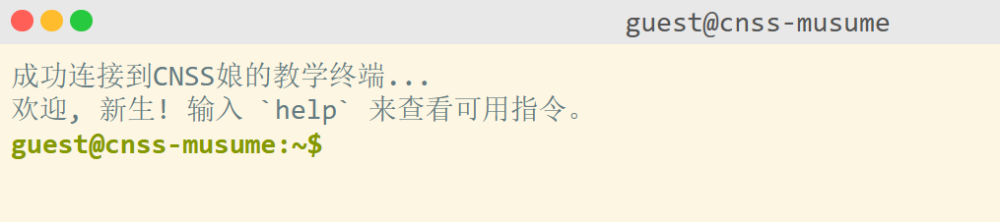
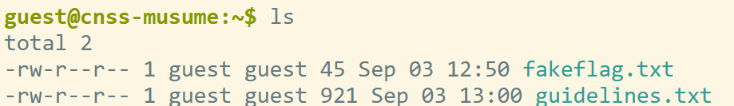
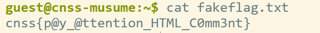
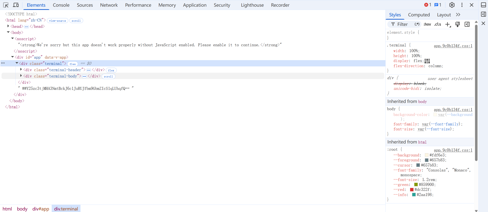

这题打开给的靶机后是一个终端界面：

然后按照指示输入 **help** ，得到显示可以用指令有：
```
help - 显示此帮助信息
whoami - 查看当前用户
ls - 列出当前目录的文件
cat <file> - 查看文件内容
sudo <command> - 尝试获取超级管理员权限
clear - 清空屏幕
```

然后输入 **ls** 来查看当前目录的文件，发现有两个文件：

其中有一个写着fakeflag的文本，显然它是一个假的flag，但是有提示，用 **cat fakeflag.txt** 打开**fakeflag.txt** 后给了我们一个提示：

让我们注意HTML的注释。所以我们可以右键鼠标点击检查或者按f12，在elements里看到了一段base64：

```
Y25zc3tjMHA3NmtBckJ6c1JuRUJfbm9GbmZIcS1qLUhqfQ==
```
解码后得到flag:
```
cnss{c0p76kArBzsRnEB_noFnfHq-j-Hj}
```